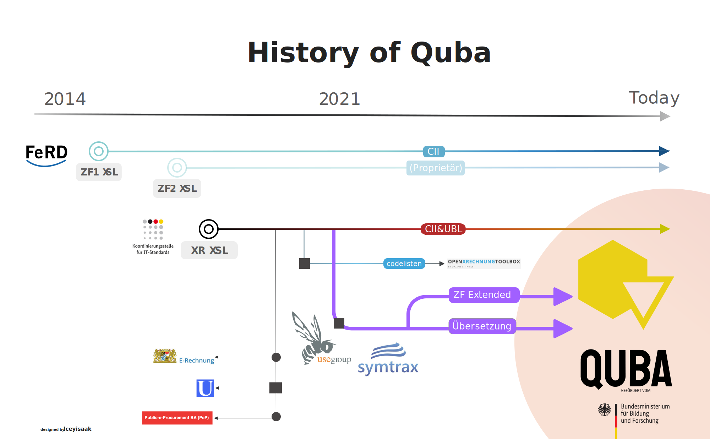

Quba-Viewer
=============

Quba-Viewer ([homepage](https://quba-viewer.org)) is a cross platform open source application to display 
structured (i.e., XML) and hybrid (Factur-X/ZUGFeRD PDF) electronic invoices.

Documentation-wise there is a doc RE [Architecture, Development, Debugging and testing](doc/development.md) in 
general and some Electron and E-Invoice peculiarities like [interprocess (IPC) communication, XSLT and codelists](doc/electron.md) in particular.

History
=============

1.4.3 

- #100 support ZF1
- #98 Correctly translate bt148 to gross instead of net
- #99 Register shortcut to close app by using cmd+q
- #88 Splash window "About" ("Info" in German) can not be closed on MacOS

1.4.2 01.11.2024

- #54 print only prints first page
- #83 NaN for VAT amount and rounding amount 
- #82 Drag&Drop does not work

1.4.1 30.10.2024

- #78 default language to OS language, if de|en|fr
- #68 structured invoice data won't get parsed from zugferd-file
- #23 Does not work on intel macs
- #63 Mention license in about window
- #58 electron 20 to 33
- #53 MSI version

1.4.0 15.01.2024

- Online validation works again
- Corrected validation now possible with personalized account  
- Be able to visualize Order-X, i.e. CIO #30
- be able to display IDs in whatever language
- Factur-X / ZUGFeRD is now visualized by default and requires no click
- first attempts intel mac
- be able to load same filename multiple times #35
- menu item context for print (/xml and /pdf) and validate 
- get rid off temp files
- changed translation from 3 files to one, translations provided by the app

1.3.0 14.04.2023

    - support ubl credit notes

1.2.1 13.10.2022

    - upgrade to Electron 20 enabling e.g. newer Mac versions to run it

1.2.0 26.09.2022

    - Allow to validate files via Mustangserver

1.1.5 15.08.2022

    - XML invoice with large PDF (approx. > 1.4 MB) attached can't be opened #16

1.1.4 23.06.2022

    - No close button for attachments #15

1.1.3 28.04.2022

    - Accept invoices as command line arguments #12

1.1.2 11.11.2021

    - Allow drag&drop of files #9

1.1.1 24.09.2021

    - The window for the example files can now be closed
    - plain pdf without embedded xml not to show button for visualization

1.1.0 20.09.2021

    - #6 New document shows still old data / invoice
    - Switch to vue.js
    - i18n: Support for EN and FR
    - support FX Referenzprofil XRechnung

1.0 23.08.2021

    - #5 Codelists are now resolved
    - Support for first FX Extended Element, i.e., Cash Discount in XML 

0.5 27.07.2021

    - Support for PDF
    - Support for Factur-X/ZUGFeRD
    - Display errors as dialog instead of hiding them 

0.2 10.06.2021

    - Support for XRechnung (UBL)
    - "dark" theming
    - possibility to open multiple files at the same time in the same viewer (tabs)
    - print 

 

0.1 2021-03-31

    - Initial release
    - Support for XRechnung (UN/CEFACT CII)
    - release for Windows on 2021-03-31, for Linux on 2101-04-16 and for Mac on 2021-04-27

 

Pedigree
-------------

The FeRD had published visualization XSLTs for ZF1 (~=UN/CEFACT C13B) as open source, unfortunately the ones for the UN/CEFACT C16B-based
version 2 remains proprietary. The Kosit released XSLT for both CII and UBL of the XRechnung (XR) which has been used for various online viewers
but also for offline viewers like Ultramarinviewer and Open XRechnung Toolbox. Quba uses this work added translations and
at least experimental support for Factur-X/ZUGFeRD profiles higher than EN16931.

Known issues
=============

  * While XRechnung, EN16931 and below should work, not all FX attributes/elements of the Extended Profile have yet been mapped, feel free to [report missing ones](https://github.com/ZUGFeRD/quba-viewer/issues) 
  * conversion of XSLT to sef.json `xslt3 -xsl:ubl-creditnote-xr.xsl -export:ubl-creditnote-xr.sef.json -t` on windows works only in cmd.exe, not powershell

 
